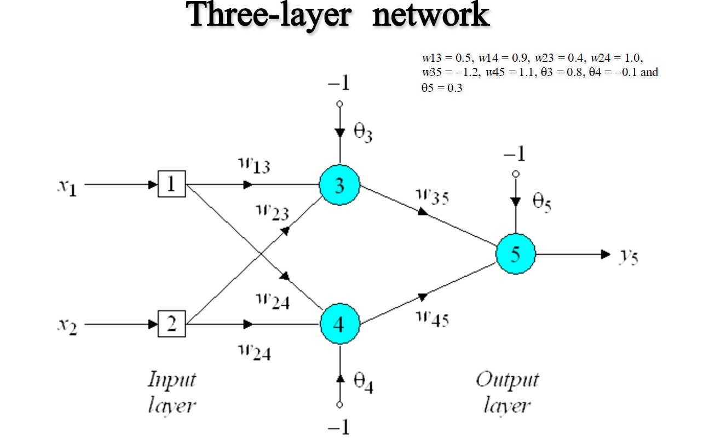

========================================================================
    CONSOLE APPLICATION : ArtificialNeuralNetwork Project Overview
========================================================================

Basic back propogation neural network solving the Exlusive Or problem. A classic
McCullogh Pitts neural network. Numerical style. 

For more information please see the book "Artificial Intelligence, A guide to Intelligent Systems" 
by Michael Negnevitsky - this book contains the source mathematics and example weights.

</img>

1) Updated with some additional versions, moving towards generalizing the calculations
into matrix form.
2) added a simple matrix class, would replace with BLAS or something (maybe eigen)
3) added a class to load the iris dataset and process into a form ready to use in a neural network
4) added some optimizations including momentum term, and learning rate heuristic tuning to prevent
oscillatory behavior with higher learning rate. This can be viewed in version 5 of the function.